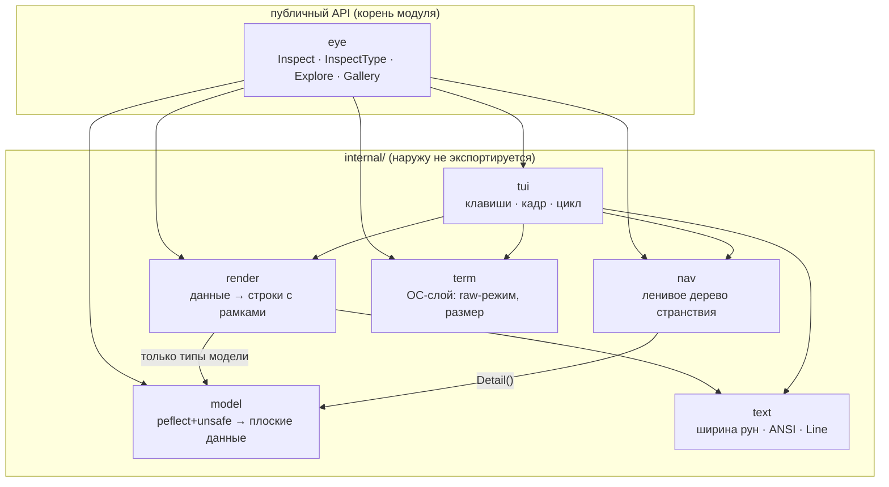
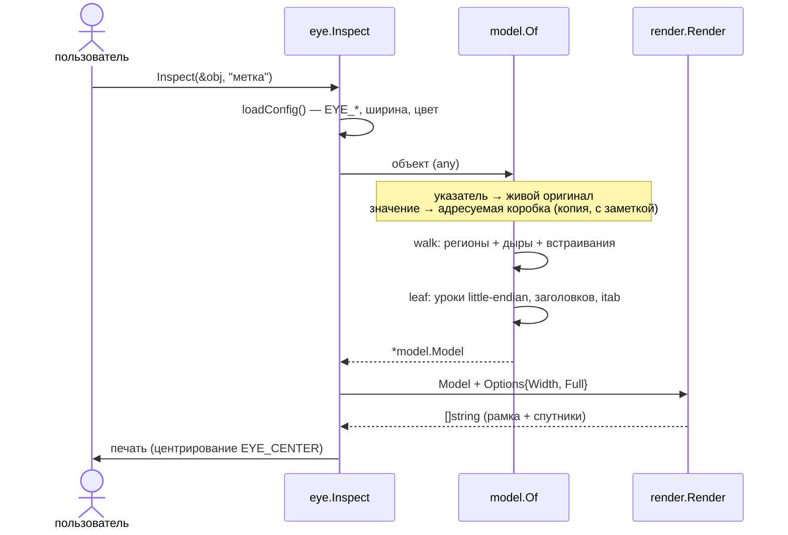
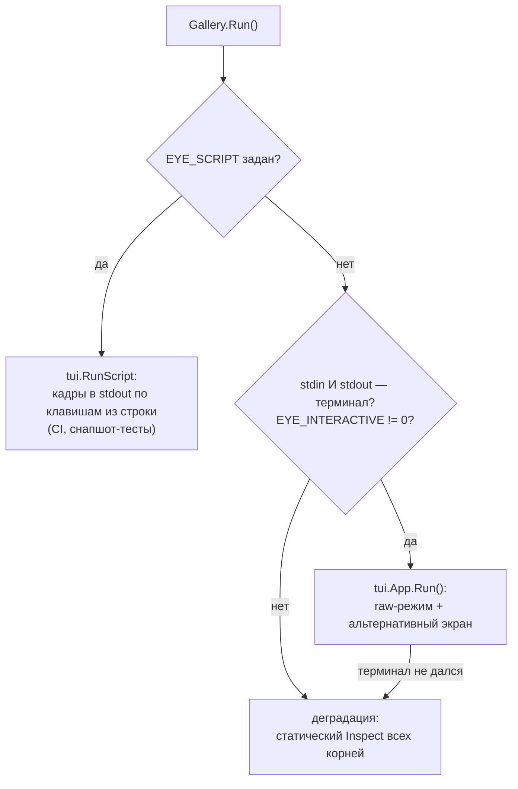
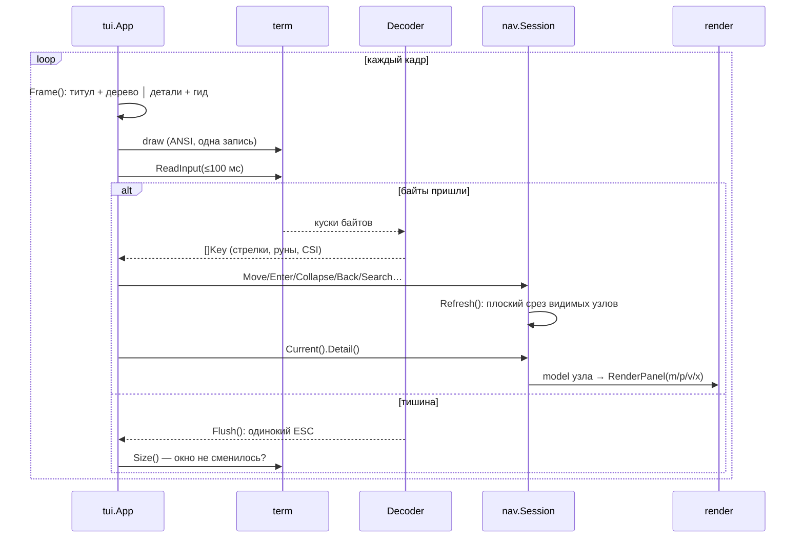

# Устройство Ока: архитектура и потоки

Этот документ — карта системы: из каких пакетов Око состоит, кто с кем
разговаривает, как данные текут от живого объекта до кадра на экране.
Справочник по структурам данных — в соседнем [data_model.md](data_model.md).

## Принципы

1. **Модель отдельно от вида.** Пакет `model` знает про `reflect`/`unsafe` и
   ничего — про цвета и рамки. Пакет `render` знает про рамки и ничего — про
   рефлексию: он рисует только плоские структуры из `model`. Граница держится
   списком import'ов и проверяется компилятором.
2. **Ленивость.** Странствие не разбирает объект целиком: узел дерева
   строится при первом раскрытии, указатель разыменовывается только по
   команде, детали узла кэшируются.
3. **Честные отказы.** Всё, чего Око не может показать корректно, оно
   называет по имени: `nil` — «идти некуда», `unsafe.Pointer` — «тип стёрт»,
   значения map — «копия, ибо не адресуемы», раскладка itab — «внутренность
   рантайма, спецификация не обещает».
4. **Ноль зависимостей.** Только стандартная библиотека: терминал — через
   `syscall`, TUI — свой, деманглер не нужен (`reflect.Type.String()`).

## Карта пакетов



Два шва, унаследованные у C++-предка:

- **Шов №1 — `model`**: всё, что добыто рефлексией, лежит в plain-структурах
  (`Model`, `Region`, `Iface`, …). Хочешь свой вывод (JSON, метрики) — бери
  `model.Of(obj, "")` и обходи данные сам, `render` не нужен.
- **Шов №2 — строки вида**: `render` возвращает `[]string` (с ANSI-цветами,
  ширина посчитана через `text`). Кому отдать строки — решает вызывающий:
  `Inspect` печатает в stdout, TUI кладёт в зону «Гримуар», тесты — в буфер.

## Поток статического осмотра (Inspect)



Ключевое решение на входе (`model.Of`):

- `Inspect(&x)` — `reflect.ValueOf(ptr).Elem()` **адресуем**: Око читает
  живую память оригинала, адреса в выводе настоящие;
- `Inspect(x)` — значение уже упаковано в `any`; Око кладёт его в адресуемую
  коробку (`reflect.New` + `Set`) и честно пишет в свитке заметок, что это
  копия. Сама упаковка interface-значения — первый урок курса.

## Поток странствия (Explore / Gallery.Run)

Сначала — выбор режима:



Затем — цикл событий. Горутин-читателей нет: на Unix `read` возвращается
максимум через 100 мс (termios `VMIN=0/VTIME=1`), на Windows вход ждётся
через `WaitForSingleObject` с таймаутом. Пустой тик — момент дозреть
одинокому `ESC` и опросить размер окна.



Кадр собирается целиком (H строк ширины W) и пишется одной операцией с
`ESC[H` + `ESC[K` — в альтернативном экране этого достаточно, чтобы не
мерцать.

### Восстановление терминала

Контракт: терминал восстанавливается **при любом исходе**.

- нормальный выход (`q` / двойной `Esc`) — `defer cleanup()`;
- `SIGINT`/`SIGTERM` (Ctrl-C) — горутина сигнала только поднимает флаг; цикл
  замечает его и выходит обычным путём (`defer`'ы восстанавливают терминал),
  а `Gallery.Run` возвращает `eye.ErrInterrupted` — код выхода процесса
  выбирает программа-хозяин, не библиотека;
- Windows: `ENABLE_PROCESSED_INPUT` снят, `Ctrl-C` приходит байтом `0x03`
  и обрабатывается как обычная клавиша выхода;
- `cleanup` идемпотентен: выйти из alt-screen, вернуть termios/режим консоли.

## Терминальный слой (internal/term)

| платформа | как | файл |
|---|---|---|
| Linux | termios `TCGETS/TCSETS`, `TIOCGWINSZ` через `syscall.Syscall` | `term_unix.go` + `term_sys_linux.go` |
| macOS | то же, номера ioctl свои (`TIOCGETA/TIOCSETA`) | `term_unix.go` + `term_sys_darwin.go` |
| Windows 10+ | `kernel32`: Get/SetConsoleMode (VT input/output), ScreenBufferInfo, WaitForSingleObject | `term_windows.go` |
| прочие ОС | «не терминал» → Око печатает статикой | `term_fallback.go` |

После включения VT-режима Windows-консоль понимает те же ANSI-последовательности,
что и Unix: весь код выше слоя `term` платформы не различает.

## Как читается itab («vtable» Go)

Значение интерфейса — два машинных слова. Для непустого интерфейса первое
слово указывает на `itab` (в рантайме — `internal/abi.ITab`):

```
interface-значение              itab (64-бит)
┌───────────────┐               ┌──────────────────────────┐
│ [0] *itab ────┼──────────────►│ +0   inter *interfacetype│
│ [1] data  ────┼──► объект     │ +8   _type *_type        │
└───────────────┘               │ +16  hash  uint32        │
                                │ +24  fun[0] uintptr ──► код метода 0
                                │ +32  fun[1] uintptr ──► код метода 1
                                └──────────────────────────┘
```

Око читает `hash` и слоты `fun[i]` прямо из живой памяти (только на
64-битных платформах) и превращает адреса в имена через
`runtime.FuncForPC`. Имена и порядок методов при этом берутся из `reflect`
(слоты отсортированы по имени — так же их сортирует рантайм), поэтому подписи
верны даже там, где сырые слоты не читаются. Раскладка itab стабильна в
gc-рантайме много лет (проверено go1.21–go1.24), но спецификацией не
обещана — Око честно подписывает это в каждом выводе.

## Соответствие оригиналу и осознанные отличия

| C++ magic_eye | здесь | статус |
|---|---|---|
| `inspect` / `inspect<T>` / label | `Inspect` / `InspectType[T]` / label | ✅ |
| `explore`, `Gallery`, клавиши TUI, `1..9`, `/ n N`, `s`, `f e c`, панели `m p v x` | те же | ✅ |
| `EYE_DESCRIBE` / `EYE_BASES` | не нужны: reflect видит всё | ✅ (урок) |
| секции: паспорт · иерархия · память · vtable · куча | паспорт · встраивание · память · интерфейсы · спутники | ✅ |
| pagination элементов по 100 | страницы `⁘ [0..99]` | ✅ |
| `EYE_WIDTH/CENTER/COLOR/FULL/INTERACTIVE/SCRIPT/HEIGHT/ASCII/SNAP_DIR` | те же | ✅ |
| `EYE_RESIZE` (растянуть legacy-консоль Windows) | не перенесено: в эпоху Windows Terminal смысла мало | ✂ осознанно |
| `docs/legacy` M0–M5 (история строительства) | своей истории пока нет | ✂ |
| Docker-обвязка `eyerun.sh` | не нужна: `go run` работает везде | ✂ |
| SSO строк | в Go SSO нет — вместо него урок `.rodata` против кучи | ≠ язык |
| vptr в объекте, offset-to-top | в Go объект чист; несколько itab, data на начало | ≠ язык |
| virtual-базы, общий под-объект в ромбе | ромб НЕ сливается: две копии базы | ≠ язык |

## Как расширять

- **Своя секция вывода** — функция `[]string` в `render`, подключить в
  `Render`/`RenderPanel`. Данные добывать только из `model.Model` (не из
  reflect — держи шов).
- **Свой сорт узла странствия** — ветка в `nav.(*Session).buildKids` +
  при необходимости пометки (`Refusal`, `Copied`, `Cycle`).
- **Своя панель деталей** — значение `render.Panel`, ветка в `RenderPanel`,
  клавиша в `tui.(*App).rune`.
- **Факты без рисования** (JSON, метрики) — используй `model.Of` напрямую;
  публичного пакета для этого пока нет — если понадобится, вынести
  `internal/model` в `pkg/` будет несложно: он ни от чего не зависит.
