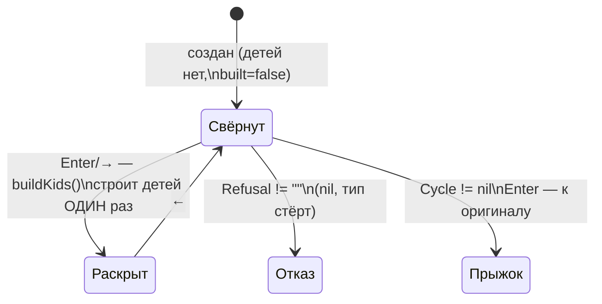

# Объекты системы и структуры данных

Справочник по всем структурам, из которых Око собрано: что хранит каждая,
кто её создаёт, кто читает, какие инварианты держит. Общая карта пакетов и
потоки — в [architecture.md](architecture.md).

## Слой модели (internal/model)

Всё, что Око добыло из объекта, лежит в одной корневой структуре:

### model.Model

| поле | тип | смысл |
|---|---|---|
| `Label` | `string` | подпись пользователя («казна», «рыцарь») |
| `Passport` | `Passport` | статика типа |
| `HasValue` | `bool` | false для `InspectType[T]` — только статика, без значений и байтов |
| `Addr` | `uintptr` | адрес объекта (коробки интерфейса) |
| `Bytes` | `[]byte` | **живые** байты объекта (`unsafe.Slice` поверх памяти — не копия) |
| `Regions` | `[]Region` | карта памяти, отсортирована по offset |
| `Embeds` | `[]Embed` | под-объекты встроенных типов |
| `Ifaces` | `[]Iface` | анатомия interface-значений |
| `Sats` | `[]Satellite` | память вне объекта (буферы, хребты, цели) |
| `Notes` | `[]string` | общие заметки: советы, происхождение копий |

Создатели: `Of(obj any)` (вход `Inspect`), `OfValue(v reflect.Value)`
(узлы странствия), `OfType(t reflect.Type)` (статика). Читатели: `render`
(рисует) и — при желании — любой сторонний код: структура намеренно plain.

### model.Region — один кусок памяти

| поле | смысл |
|---|---|
| `Kind` | `RField` (поле) · `RPadding` (дыра) · `RWord` (служебное слово) |
| `Offset`, `Size` | положение в объекте; регионы не пересекаются, дыры заполняют разрывы |
| `Name` | «hp», «pos.x» (вложенность через точку), «значение» у корня |
| `TypeName` | `reflect.Type.String()` |
| `Value` | строковое значение с уроком: `100 (0x64)`, `len 3 · cap 8 · data 0x…` |
| `Note` | причина дыры / устройство заголовка / little-endian / ловушка |
| `From` | тип встроенной структуры, из которой поле пришло («из main.Unit») |

Инварианты карты регионов:

- регионы отсортированы по `Offset` и покрывают объект без пересечений;
- каждая дыра несёт причину: «поле X требует адрес, кратный N» либо
  «хвост структуры добит до кратного align»;
- поле нулевого размера даёт регион `Size == 0` (рисуется одной выноской);
- байты региона рендер берёт из `Model.Bytes[Offset:Offset+Size]` — сами
  регионы байтов не хранят.

### model.Passport, model.Embed

`Passport`: `TypeName`, `Kind` (по-русски), `Size`, `Align`, `Traits`
(comparable · виден ли GC · нулевой размер · размер method set).

`Embed`: `Depth` (этаж встраивания), `TypeName`, `FieldName`, `Offset`,
`Size`, `Promoted` (методы, продвинутые наружу — пересечение method set
встроенного и внешнего типов), `Note` (например, «встроен указатель»).

### model.Iface, model.Method — анатомия интерфейса

| поле | смысл |
|---|---|
| `Where` | «объект целиком» или имя поля |
| `Empty` | eface (`any`, без методов) или iface (с itab) |
| `TypeName` / `DynType` | статический тип интерфейса / динамический тип внутри |
| `TabAddr`, `DataAddr` | сырые два слова, прочитанные из памяти объекта |
| `Hash` | `itab.hash` (копия хеша типа — ускоряет type switch) |
| `Methods` | слоты: `Name` (из reflect), `PC` (из `itab.fun[i]`), `Func` (`runtime.FuncForPC`) |
| `TypedNil` | ловушка: слово типа заполнено, data — nil |
| `Note` | происхождение знания / предупреждение |

Гейты честности: сырые `Hash`/`PC` читаются только на 64-битных платформах
(`unsafe.Sizeof(uintptr) == 8`); имена методов верны всегда — они из reflect.

### model.Satellite — память вне объекта

`Title`, `Addr`, `Size`, `Bytes` (сырые байты: строки, цели указателей),
`Elems` (готовые строки: элементы среза, пары map), `Note`. Спутники создаёт
`leaf.go` при разборе поля (строка → буфер, срез → хребет + cap-хвост,
map → пары, указатель на скаляр/мелкую структуру → цель).

### Чтение приватного: `readable`

Единственная точка, где обходится запрет reflect на чтение
неэкспортированных полей:

```go
reflect.NewAt(v.Type(), unsafe.Pointer(v.UnsafeAddr())).Elem()
```

Требует адресуемости — поэтому весь конвейер Ока держит значения
адресуемыми (см. инварианты странствия ниже).

## Слой странствия (internal/nav)

### nav.Node — узел дерева

| поле | смысл |
|---|---|
| `Label`, `Sub` | «banner», «[42]», «▣ main.Unit» + аннотация «тип · значение» |
| `Val` | **живой** `reflect.Value` (адресуемый, где это возможно) |
| `TypeOnly` | вместо Val у узлов «тип без объекта» (`AddType`) |
| `Parent`, `Depth`, `Expanded` | геометрия дерева |
| `Refusal` | почему не раскрыть: «nil», «тип стёрт»… (пусто = можно) |
| `Cycle` | не-nil ⇒ узел-ссылка `⟲` на уже показанный узел |
| `Copied` | пометка «это копия» (значения map не адресуемы) |
| `kids`, `built`, `buildRange` | ленивые дети; страницы коллекций строят свой диапазон |
| `detail` | кэш `*model.Model` для панели деталей |

Жизненный цикл узла:



Правила `buildKids` (типизированный строитель):

| kind значения | дети |
|---|---|
| struct | поля; анонимные — узлы `▣` встраивания |
| pointer | один ребёнок «➤ цель» — живой `Elem()`; если адрес+тип уже показаны — узел `⟲` |
| interface | «◈ динамика»: живые данные коробки (`NewAt` по слову data) либо честная копия |
| slice / array | элементы; длиннее 100 — узлы-страницы `⁘ [0..99]` |
| map | пары (снимок `MapRange`); значения — копии с пометкой |
| string | детей нет: байты видны в деталях |
| chan / func / скаляры | детей нет |

### nav.Session — состояние странствия

| поле | смысл |
|---|---|
| `Roots` | корни галереи |
| `visible` | плоский срез видимых узлов (пересчёт `Refresh()` после каждого expand/collapse) |
| `Cursor` | индекс в `visible` |
| `history` | стек прыжков (⟲, поиск) для `b`/⌫ |
| `seen` | `map[{addr,type}]*Node` — учёт показанных адресов: дубли не плодятся, циклы получают `⟲` |

Операции: `Move`, `Enter`, `Collapse`, `ExpandAll` (глубина ≤4),
`CollapseAll`, `JumpTo`/`Back`/`JumpRoot`, `Search` (по видимым узлам,
label+sub, с курсора по кругу).

## Слой интерфейса (internal/tui)

### tui.Decoder — байты → клавиши

Конечный автомат без таймеров внутри: незавершённая ESC-последовательность
ждёт следующего куска, одинокий `ESC` добывается внешним `Flush()` по
таймауту тика. Понимает CSI (`ESC[…X`, включая `5~/6~`), SS3 (`ESC O X`),
UTF-8 руны кусками, `Ctrl-C` байтом.

### tui.App — состояние экрана

| группа | поля |
|---|---|
| геометрия | `W, H`, `treeTop` (прокрутка дерева), `detTop` (прокрутка деталей) |
| фокус/режимы | `focus` (дерево/детали), `panel` (всё/m/p/v/x), `full` (f), `help` |
| поиск | `searching`, `query`, `lastQuery` |
| детали | `detNode/detPanel/detFull/detW` + `detLines` — кэш отрисованных строк |
| снимки | `snapN`, `snapDir` (EYE_SNAP_DIR) |

Кадр (`Frame()`) всегда ровно `H` строк ширины `W`:

```
строка 0      ◉ титул: галерея корней [1][2]… + активная панель
строка 1      ярлыки зон: ▌ ДЕРЕВО ▐ │ ── детали  (фокус — громкой плашкой)
строки 2…H-2  дерево (≈2/5 ширины) │ «Гримуар» (детали узла)
строка H-1    гид по клавишам / строка поиска / статус-сообщение
```

Фокус (`Tab`) обозначен трижды: плашкой в ярлыках зон, золотым разделителем
со стороны деталей и меткой `[дерево]/[детали]` в гиде. `←` из зоны деталей
возвращает фокус в дерево, не сворачивая выбранный узел.

Детали пересобираются только при смене (узел, панель, f, ширина) — кэш
инвалидируется сравнением этих четырёх значений.

## Слой вида (internal/render)

- `Options{Width, Full, Bare}` — ширина рамки и режим развёртки.
- `Panel` — `PanelAll/Mem/Pass/Iface/Hex` (клавиши всё/m/p/v/x).
- Карта памяти: раскладка колонок адаптивна — на узких панелях сначала
  исчезает ascii-колонка, затем кирпичи; выноски переносятся по словам под
  оставшуюся ширину. Байт со смещением N всегда в колонке N%8.
- Регионы длиннее 4 строк сворачиваются «⋯ ещё N Б ⋯» (`f`/`EYE_FULL=1`
  развернёт).

## Слой текста (internal/text)

- `VisWidth`/`ClipVis`/`PadVis` — экранная ширина с учётом ANSI-escape и
  широких рун (CJK/эмодзи = 2 колонки).
- `Line` — строитель строки, который сам считает видимую ширину (только он
  используется для вёрстки — «сырой» `len(s)` в вёрстке запрещён).
- `Color`, `ASCII` — глобальные выключатели (ставятся из `EYE_COLOR`,
  `EYE_ASCII` при каждом входе в публичный API).

## Сквозные инварианты

1. **Адресуемость.** Всё, что Око показывает как «живую память», адресуемо:
   корни — оригинал за указателем или коробка `reflect.New`; поля/элементы
   наследуют адресуемость родителя. Неадресуемое (значения map) копируется
   и явно помечается.
2. **Байты не копируются.** `Model.Bytes` и `Satellite.Bytes` — `unsafe.Slice`
   поверх живой памяти. Отсюда контракт галереи: объекты живут, пока идёт
   `Run()`.
3. **Чужая память не читается.** Переходы только по типизированным
   указателям; `unsafe.Pointer`/`uintptr` — тупики с причиной.
4. **Всякое сомнительное знание подписано.** Раскладка itab, копии map,
   копия при `Inspect(значение)` — у каждого такого факта есть заметка
   о происхождении.
